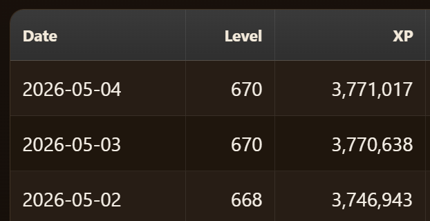
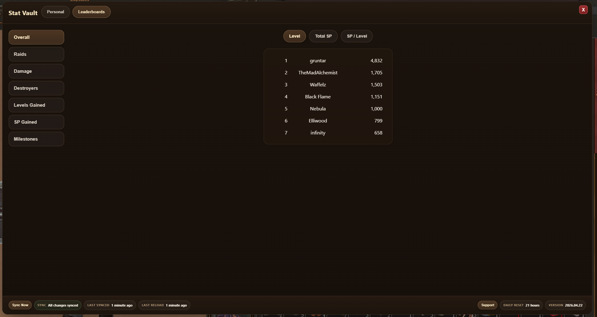
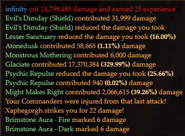

# DOTV Tools

A collection of scripts and tools I made for Dragons of the Void.

## Quick Links

### Userscripts

- [Stat Vault](#stat-vault) - in-game stat tracking, history, and leaderboards
- [Magic Percent](#magic-percent) - battle log percentages for magic procs

### Standalone Tools

- [Formation Optimizer](#formation-optimizer) - web tool for testing and optimizing formations

## How to Install Userscripts

These scripts require a userscript manager such as [Tampermonkey](https://www.tampermonkey.net/).

1. Install Tampermonkey for your browser.
2. Click one of the install links below.
3. Tampermonkey should open an install page.
4. Click **Install**.
5. Reload Dragons of the Void.

## Userscripts

### Stat Vault

Track your Dragons of the Void progression with an in-game dashboard, milestone tracking, leaderboards, and cross-device sync.

[Install Stat Vault](https://github.com/MattiasKDev/dotv-public/raw/main/userscripts/statvault.user.js)

#### How to Use

1. Open the **Profile** tab in DOTV.
2. Click the **Stat Vault** button.
3. Use the **Personal** and **Leaderboards** tabs to view your stats.

### Magic Percent

Adds percentage context to magic procs in the battle log. Damage magic shows how much it contributed compared to your base damage, and mitigation magic shows the reduction percent when available.

[Install Magic Percent](https://github.com/MattiasKDev/dotv-public/raw/main/userscripts/magicpercent.user.js)

#### How to Use

Install the script and attack a raid. Magic proc lines in the battle log will automatically show percentages.

## Standalone Tools

### Formation Optimizer

A web tool for experimenting with DOTV formations and comparing formation setups.

[Open Formation Optimizer](https://mattiaskdev.github.io/formation-optimizer/)

## Support

For issues, suggestions, or requests, contact me on Discord: **infinity04**
